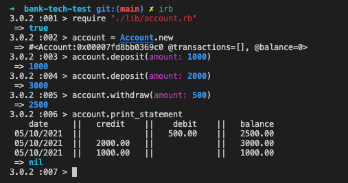

# Bank Tech Test

This is a command line application written in Ruby that delivers the basic functionality of a bank account. A user can make an account, make deposits and withdrawals, and see their account statement. 

This program was written using a test-driven development approach for a Makers Academy tech test. The specification for the test can be seen below.

## Prerequisites

* You have installed Ruby

## How to install

1. Clone this repository to your local machine
2. Run the command `gem install bundler` (if you don't have bundler already)
3. When the installation completes, run `bundle`

## How to use this program

1. Open a Ruby REPL (e.g IRB) via the command line and load account.rb
````
irb
require './lib/account.rb'
```` 
2. To create a new bank account:
````
account = Account.new
```` 
3. To make a deposit:
````
account.deposit(amount: 10)
````

4. To make a withdrawal:
````
account.withdraw(amount: 10)
````

5. To view your account statement:
````
account.print_statement
````

Here is an example of the working application:



## How to run the tests

Run the following command from your command line whilst in the project directory:
````
rspec
````

## Specification

### Requirements

* You should be able to interact with your code via a REPL like IRB or the JavaScript console.  (You don't need to implement a command line interface that takes input from STDIN.)
* Deposits, withdrawal.
* Account statement (date, amount, balance) printing.
* Data can be kept in memory (it doesn't need to be stored to a database or anything).

### Acceptance criteria

**Given** a client makes a deposit of 1000 on 10-01-2023  
**And** a deposit of 2000 on 13-01-2023  
**And** a withdrawal of 500 on 14-01-2023  
**When** she prints her bank statement  
**Then** she would see

```
date || credit || debit || balance
14/01/2023 || || 500.00 || 2500.00
13/01/2023 || 2000.00 || || 3000.00
10/01/2023 || 1000.00 || || 1000.00
```
